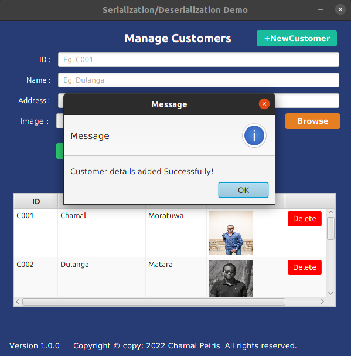

# Java Serialization
**This repository consists of an application that was developed in order to learn and understand how serialization and deserialization works in java. Basically, the objects will be converted to bytes and stored in a text file which is allocated as a local resource and at the same time , fetched via  deserialzation and displayed on a table. Furthermore, java ObjectInputStream and ObjectOutPutStream classes are made use inorder to achieve bother serialization and deserialization**
### How to use this repo?

1. Clone the repository first  'git clone'

``https://github.com/Chamal-Peiris/java-serialization.git``

2. Once cloned, open the repository from any prefered IDE

3. Build and Run!

### Prerequisites
1.Use JDK 1.8

## Main User Interface

## Add Customers

## Select Customer

## Update Customers

## Usage

* This application simply uses java ObjectInput and ObjectOutput stream classes inorder to perform both serialization and deserialization.
* A Text file will be used as a database inorder to store and retrieve objects in the form of bytes.

### License

Version 1.0.0 , 13 March 2022

Copyright © copy; 2022 Chamal Peiris. All rights reserved.

Licensed under the [MIT](LICENSE) license

## Acknowledgements

* [Choose an Open Source License](https://choosealicense.com)